# TelegramYou, build by build

The same screens from every green build of `main`, newest first,
taken by the UI workflow on an emulator running the demo client.
Written by `.github/scripts/gallery.py`; do not edit by hand.

## 0.2.294

2026-09-24 · [`bff6e05`](https://github.com/TemaSil/TelegramYou/commit/bff6e05e2792f654c355cb53cd414535aeca72e5)

  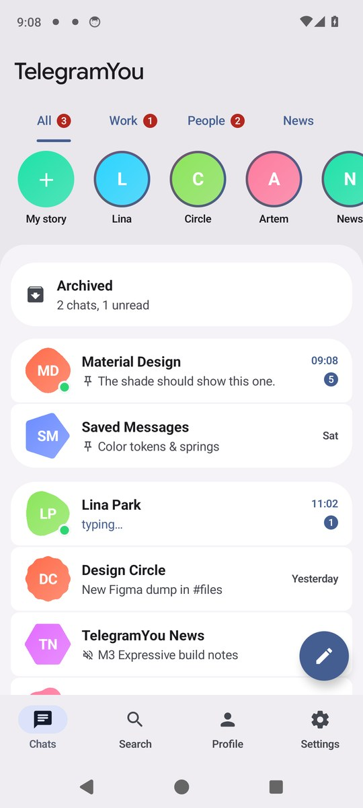
  
  
  
  
  
  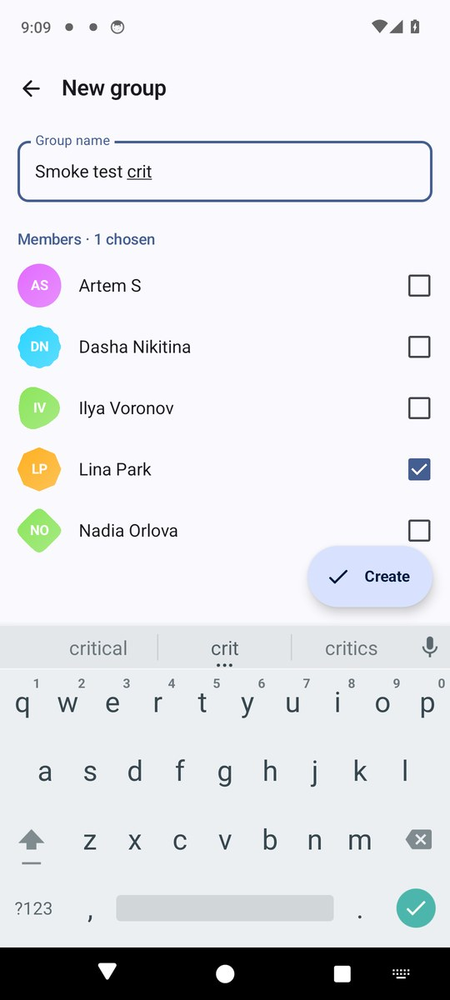
  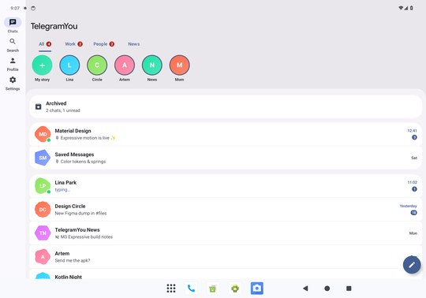

## 0.2.288

2026-09-24 · [`1c00031`](https://github.com/TemaSil/TelegramYou/commit/1c00031d4b956a87a4b1e77c754542ce96e3951d)

  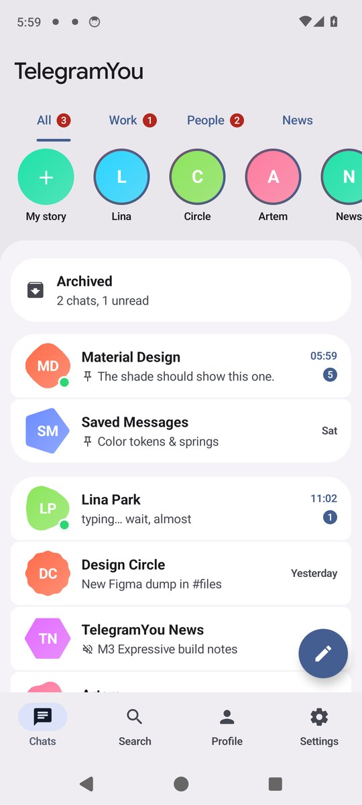
  
  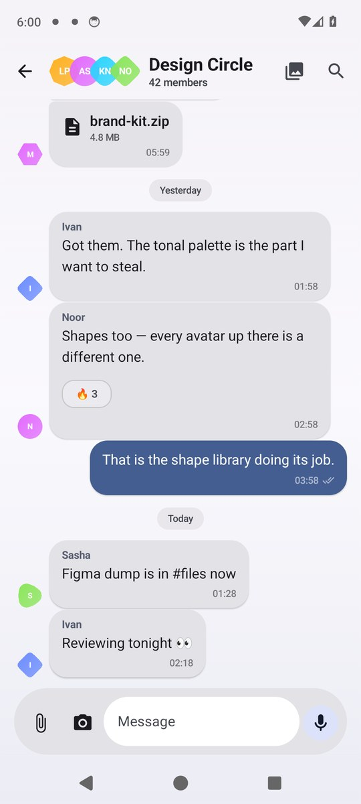
  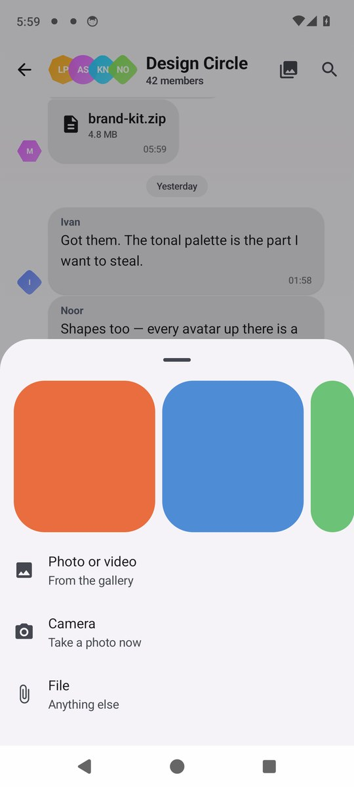
  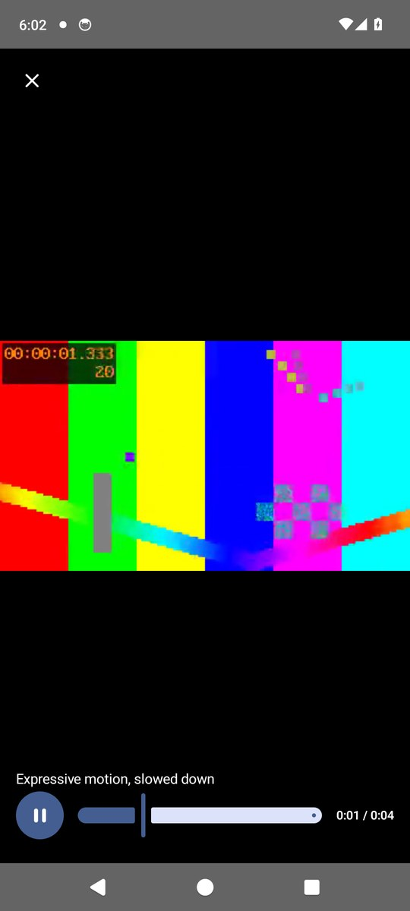
  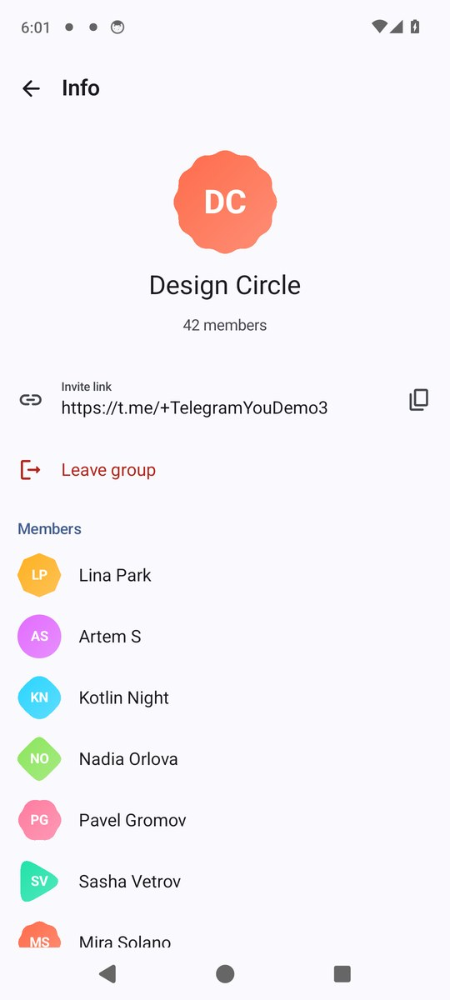
  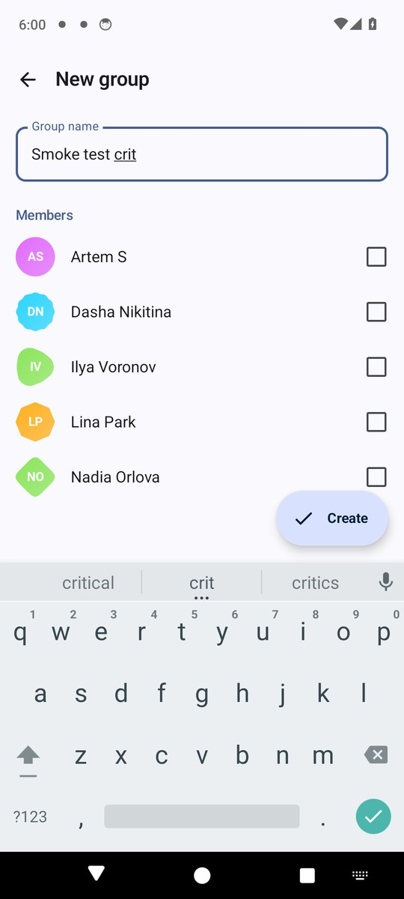
  

## 0.2.284

2026-09-24 · [`923400e`](https://github.com/TemaSil/TelegramYou/commit/923400e971cdf656753dfe7855f6abd5e8eecd5d)

  
  
  
  
  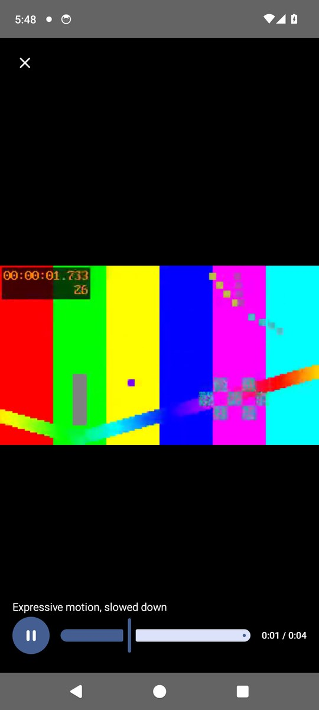
  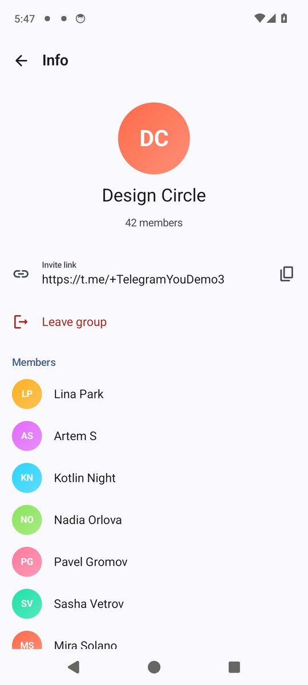
  
  

## 0.2.281

2026-09-24 · [`7be9517`](https://github.com/TemaSil/TelegramYou/commit/7be95172a6c85926c6df04d781ee84ab0ac57f80)

  
  
  
  
  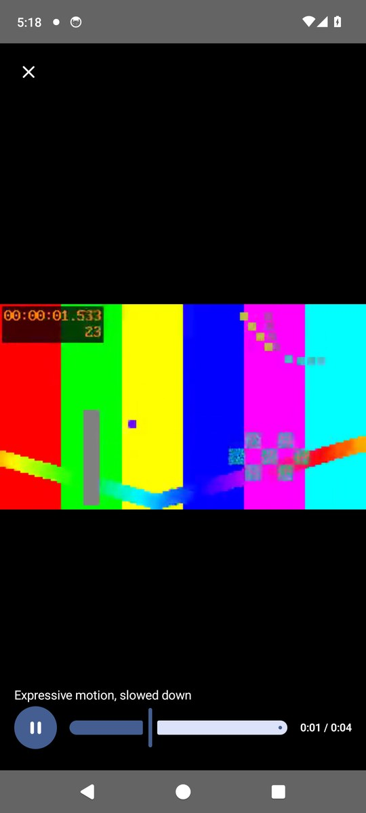
  
  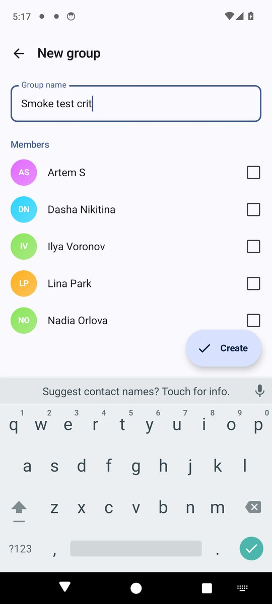
  

## 0.2.276

2026-09-24 · [`2ca371f`](https://github.com/TemaSil/TelegramYou/commit/2ca371f331ef8b753d9e09e452bb782c0e791a93)

  
  
  
  
  
  
  
  

## 0.2.273

2026-09-24 · [`92190c2`](https://github.com/TemaSil/TelegramYou/commit/92190c2fc2e5851121beb9499c73f5b91c984b0f)

  
  
  
  
  
  
  
  

## 0.2.271

2026-09-24 · [`ba2941b`](https://github.com/TemaSil/TelegramYou/commit/ba2941bf81a6367869cb2a5609fd8ebaee212bbf)

  
  
  
  
  
  
  
  

## 0.2.268

2026-09-24 · [`877ce4e`](https://github.com/TemaSil/TelegramYou/commit/877ce4e75269355ba6170246b7f183b776632db0)

  
  
  
  
  
  
  
  

## 0.2.265

2026-09-24 · [`7e889ca`](https://github.com/TemaSil/TelegramYou/commit/7e889cad7c8917fc038a2148c8a58f992de27b7d)

  
  
  
  
  
  
  
  

## 0.2.263

2026-09-23 · [`09bfe84`](https://github.com/TemaSil/TelegramYou/commit/09bfe8486cd4acb5e03725213c558f0879eef9f4)

  
  
  
  
  
  
  
  

